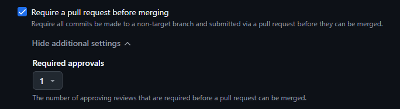
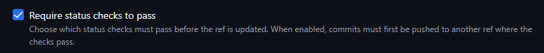
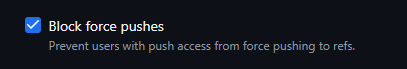
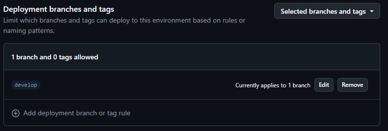
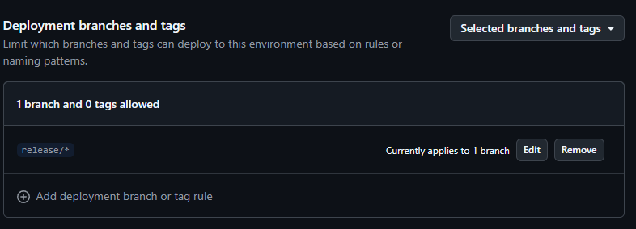
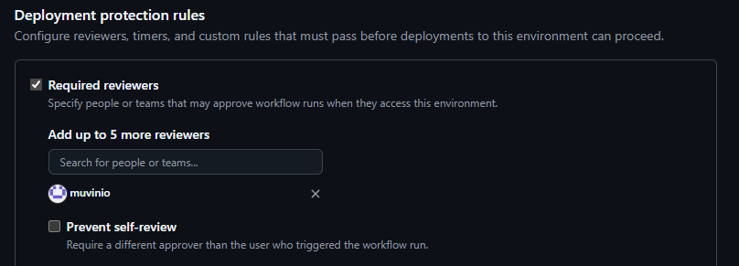
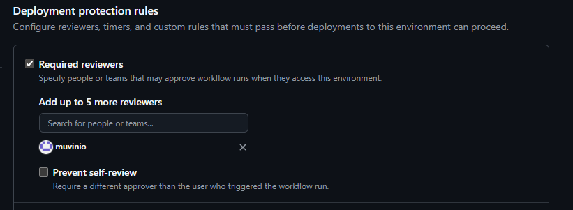
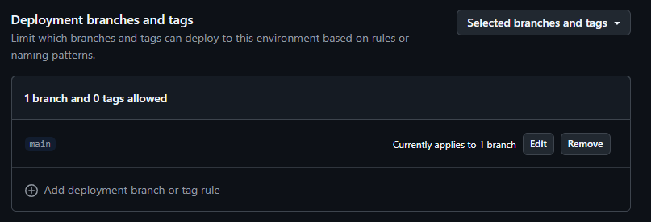
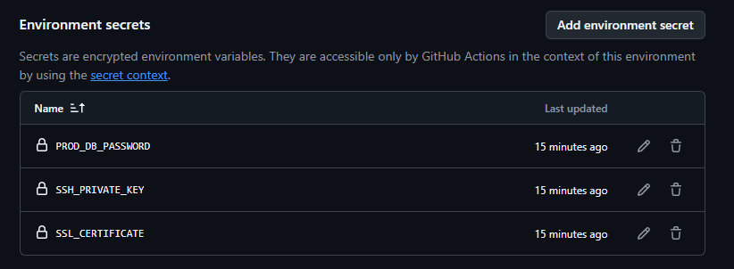

# Задание №4 (Удаление копий)

## Условие задачи
Дано: 
Виртуализация — Hyper-V/KVM/Vmware; 
VSC - BitBucket / GitHub; 
TaskTracker — JIRA/RM; 
Wiki — Confluence. 
 
Задача: 
Построить полностью инфраструктуру под проект. Из 10 человек (1 PM, 1 DevOps, 3 QA, 2 DevLead, 3 DevJunior).
Собираем статичный сайт с БД с доступом по DNS имени с SSL сертификатом с запуском из Docker контейнера через Docker Compose. 
Ограничить джун разработчиков от продакшена и нарезать ветки проекта. 
Организовать мониторинг системных метрик и логов, дать доступ QA. 
Помочь QA с организацией тестирования с мобильных устройств. 
Ваши действия? 

## 1. Виртуализация (KVM)

Для обеспечения максимальной безопасности и отказоустойчивости проекта архитектурой предусмотрено развертывание трех изолированных стендов на независимых виртуальных машинах:

Контур *dev*: выделяется под нужды разработчиков. В этой среде происходят оперативное развертывание, эксперименты с кодом и первичная интеграция новых фич.

Контур *staging*: площадка для QA-инженеров. Данная является максимально приближенной копией продакшена, что гарантирует достоверность финального тестирования.

Контур *prod*: полностью изолированная инстанция, где функционирует стабильная и доступная для конечных пользователей версия сайта.

Доступ к проду строго ограничивается узким кругом ответственных лиц (DevOps и DevLead). Это полностью исключает несанкционированное или случайное воздействие на стабильность и доступность сервиса.

## 2. Система контроля версий (GitHub)

Управление кодом организуется по методологии GitFlow:

1) Ветка main: содержит стабильный, протестированный код, готовый к эксплуатации на продакшене.

2) Ветка develop: служит для объединения и проверки всего кода, который пишут разработчики.
    ```
    git checkout -b develop
    git push -u origin develop
    ```

3) Ветки feature/*: выделенные временные ветки для изоляции разработки отдельных задач и новых фич.
    ```
    git checkout develop
    git pull origin develop
    git checkout -b feature/PROJECT-123-login-page
    ```

4) Ветки release/*: используются для доработки, тестирования и финальной подготовки кода к релизу.

5) Ветки hotfix/*: служат для срочных исправлений ошибок.

Для защиты веток main и develop включается политика Branch Protection, которая запрещает force push и прямое вливание кода. Любые мерджи в эти ветки становятся возможны только через Pull Request после обязательного ревью от DevLead и успешного прохождения CI.

Чтобы ограничить джунов от продакшена была настроена жесткая политика защиты веток на GitHub и внедрен механизм CODEOWNERS.

В файл CODEOWNERS записываются аккаунты DevLead и DevOps как владельцев всего исходного кода в проекте.

1) Require a pull request before merging

Полностью блокирует возможность прямого пуша для разработчиков. Ни один человек в команде не может в обход системы закинуть свой локальный код сразу на сервер. Любое изменение теперь обязано пройти через процедуру Pull Request.

2) Require review from Code Owners

Связывает настройки защиты с файлом CODEOWNERS. Этот пункт гарантирует, что одобрение из предыдущего шага имеет право поставить только DevLead или DevOps. Апрувы от обычных разработчиков системой учитываются как комментарии, но зеленую кнопку мерджа они не разблокируют.

3) Required approving reviews = 1

Устанавливает обязательный барьер. Код должен быть кем-то прочитан и валидирован.



4) Require status checks to pass

Зачем: Этот пункт связывает GitHub с пайплайном. Он блокирует кнопку мерджа, если автоматические тесты упали или сборка проекта завершилась ошибкой.



5) Block force pushes

Защищает репозиторий от деструктивных команд. Если случайно переписать историю коммитов у себя на компьютере и попытаться залить её на GitHub, сервер заблокирует эту попытку. Это гарантирует, что чужая работа в ветках main и develop никогда не будет стерта, а история проекта останется чистой и предсказуемой.



## 3. Автоматизация процессов
Для обеспечения работы политик безопасности и автоматической проверки кода настраиваются два базовых пайплайна:

*CI* - триггерится автоматически при каждом создании Pull Request в ветки develop и main.

Этапы: Линтинг, запуск юнит-тестов и сборка тестового Docker-образа.

Результаты этого пайплайна как раз и являются теми самыми Status Checks, без успешного прохождения которых GitHub физически блокирует джуну кнопку мерджа.

*CD* - запускается только при слиянии кода в main.

Этапы: Сборка финального Docker-образа, пуш в Registry и деплой на Staging.

Ограничение прав: Доступ к секретам репозитория (ключам деплоя и паролям от серверов) изолирован. Джуниоры не имеют к ним доступа, поэтому физически не могут повлиять на продакшен-окружение в обход автоматики.

## 4. Разграничение доступа к окружениям и секретам

Для защиты инфраструктуры в проекте настроено строгое разграничение доступа к серверам и секретам через механизм GitHub Environments. Каждый стенд привязан к своей ветке: develop деплоится на Dev, release/* — на Staging, а main — на Prod.

Dev-стенд открыт для всей команды, включая джунов, которым предоставлен доступ по SSH и к логам для отладки кода. 

На Staging джуны уже не допускаются. Туда имеют доступ только DevOps и QA для проведения финального тестирования, а просмотр логов для разработчиков выносится во внешние системы мониторинга. 

Прод полностью изолирован на сетевом уровне: доступ к нему закрыт для всех, кроме DevOps и DevLead, а вход осуществляется строго через корпоративный VPN с двухфакторной аутентификацией.

Управление секретами также изолировано внутри настроек GitHub Environments. Значения продакшен-секретов надежно зашифрованы и физически недоступны для джунов. Даже при изменении конфигурации пайплайна в своей ветке джуниор не сможет прочитать или применить эти данные, так как запуск задач в проде заблокирован на уровне прав GitHub. Дополнительно деплой на Staging и Prod защищен ручным подтверждением, что полностью исключает случайную доставку непроверенного кода на критические узлы системы.

*Окружение Dev*:

Настроено на свободный прием изменений. В качестве разрешенного источника деплоя для него зафиксирована ветка develop. Дополнительные ограничения на ручное подтверждение здесь намеренно отключены, чтобы не замедлять CI и позволить джунам тестировать свой код.



*Окружение Staging*:

Доступ к деплою в этот контур ограничен строго для веток семейства release/*. Дополнительно для этого окружения активировано ручное подтверждение. Это гарантирует, что автоматика не обновит пре-продакшен стенд до тех пор, пока DevOps или лид команды не подтвердят запуск релиза вручную после прохождения базовых тестов.





*Окружение Prod*:

Максимальный уровень защиты. Доставка кода в этот контур жестко ограничена правилом Selected branches and tags и разрешена исключительно из стабильной ветки main. Любая попытка запустить деплой продакшена из других веток полностью блокируется платформой на этапе старта. Для выполнения деплоя требуется безальтернативный ручной апрув от DevLead или DevOps, а все критические секреты (пароли БД, SSL-сертификаты) зашифрованы и изолированы внутри этого окружения без возможности просмотра рядовыми разработчиками.







## 5. Развертывание приложения

На всех трех виртуальных машинах используется Docker Compose. Логика веб-сервиса упаковывается в изолированный Docker-контейнер со статическим сайтом. Результат встраивается напрямую в образ. Веб-сервер связывается во внутренней закрытой сети Docker с контейнером базы данных. При этом сама БД не публикуется наружу и не имеет внешних портов, что полностью изолирует её от сетевых атак, а доступ к ней имеет только контейнер самого сайта.

Доступ к контурам из внешней сети организуется по уникальным DNS-именам, настроенным для каждого окружения отдельно. Для прода основное имя example.com регистрируется через доменного регистратора и привязывается к публичному IP-адресу прод-сервера. Для стейджинг и дева маршрутизация организуется на уровне локального DNS-сервера внутри защищенного корпоративного VPN-контура. В качестве обратного прокси, веб-сервера и TLS-терминатора в Compose-файле поднимается связка Nginx и Certbot. Чтобы обеспечить полную универсальность конфигурации и исключить ручную правку файлов под каждый стенд, в архитектуре применяется динамическая шаблонизация через механизм envsubst. При старте контейнера Nginx автоматически считывает шаблон nginx.conf.template, подставляет в него реальное имя домена из локального файла переменных окружения .env конкретного сервера и генерирует итоговый рабочий конфиг.

Для решения проблемы, когда Nginx не может запуститься на 443 порту без SSL-ключей, а Certbot не может выпустить эти ключи без работающего Nginx — в Dockerfile заложена автоматическая инициализация. При первом запуске скрипт динамически создает необходимые директории и генерирует временные самоподписанные сертификаты, позволяя веб-серверу успешно стартовать.

Вслед за этим просыпается контейнер Certbot. Благодаря установленной внутри него утилите docker-cli и примонтированному системному сокету /var/run/docker.sock, Certbot имеет безопасный доступ к управлению контейнерами верхнего уровня. Он беспрепятственно проходит проверку через открытый 80-й порт, автоматически выпускает валидные SSL-сертификаты от Let's Encrypt по протоколу ACME, перезаписывает ими заглушки в общем томе certbot_etc и отправляет команду перезагрузки конфигурации docker exec webserver nginx -s reload напрямую в соседний контейнер. В дальнейшем Certbot в фоновом режиме раз в 12 часов проверяет необходимость обновления сертификатов и инициирует мягкий релоад Nginx, гарантируя постоянную защиту контура и работу по HTTPS без остановки сервиса и ручного вмешательства инженера.

## 6. Мониторинг системных метрик и логов

Для обеспечения полной наблюдаемости инфраструктуры, своевременного выявления узких мест и отладки разворачивается стек мониторинга и логирования на базе Prometheus, Grafana и Loki. Данный комплекс выносится на отдельную выделенную виртуальную машину, чтобы сбор метрик и тяжелые поисковые запросы не утилизировали ресурсы серверов.

Сбор метрик на хостах и внутри изолированных контейнеров реализуется с помощью специализированных агентов-экспортеров:

1) Node Exporter разворачивается в виде демона на всех трех виртуальных машинах для непрерывного съема низкоуровневых системных показателей (утилизация CPU, распределение RAM, дисковые операции ввода-вывода I/O и сетевая активность).

2) cAdvisor интегрируется в Docker-окружение для детального анализа работы самих контейнеров, отслеживая потребление ресурсов каждым конкретным сервисом в реальном времени.

3) PostgreSQL Exporter подключается к закрытой внутренней сети backend_net и собирает специфичные метрики базы данных, не нарушая сетевой периметр СУБД.


*prometheus.yml* на сервере для метрик

```
global:
  scrape_interval: 15s # Частота сбора метрик
  evaluation_interval: 15s

scrape_configs:
  - job_name: 'node_exporter'
    static_configs:
      - targets:
          - 'dev-server.internal:9100'
          - 'staging-server.internal:9100'
          - 'prod-server.internal:9100'

  - job_name: 'cadvisor'
    static_configs:
      - targets:
          - 'dev-server.internal:8080'
          - 'staging-server.internal:8080'
          - 'prod-server.internal:8080'

  - job_name: 'postgres_exporter'
    static_configs:
      - targets:
          - 'dev-server.internal:9187'
          - 'staging-server.internal:9187'
          - 'prod-server.internal:9187'
```


Для работы с логами применяется современный легковесный подход на базе связки Loki + Promtail. Все контейнеры приложения изначально проектируются по принципам методологии 12-Factor App и выводят логи исключительно в стандартные потоки stdout и stderr. На каждом сервере запускается агент Promtail, который через монтирование системного Docker-сокета автоматически перехватывает эти потоки, дополняет их метаданными (имя контейнера, окружение, ID) и упаковывает в централизованное хранилище Loki.

Единой точкой визуализации и анализа данных выступает Grafana, где агрегируются три ключевых типа дашбордов:

1) Infrastructure Dashboard - тепловые карты и графики утилизации физических ресурсов виртуальных машин.

2) Application Metrics - аналитика веб-сервера (время ответа Nginx, распределение статус-кодов, количество запросов и динамика ошибок).

3) Log Viewer — консоль сквозного поиска и фильтрации логов со всех контуров с возможностью мгновенного сопоставления графиков метрик с текстовыми ошибками в коде.

QA и разработчики получают доступ к интерфейсу Grafana удаленно через защищенный VPN. При этом учетные записи распределяются через систему внутренних команд. Для аккаунтов тестировщиков жестко фиксируются роли уровня Viewer и Read Only. Это полностью исключает риск случайного или несанкционированного изменения конфигурации дашбордов, удаления метрик или модификации алертов, предоставляя инженерам полноценный инструмент для поиска багов и проверки верстки без прямого доступа к операционной системе серверов.

## 7. Организация тестирования с мобильных устройств

Задача DevOps заключается в исключении рутинных сетевых и конфигурационных операций для команды QA путем автоматизации пайплайнов и обеспечения безопасной маршрутизации трафика.

Взаимодействие с командой QA и поддержка процессов тестирования реализуются по следующим направлениям:

1) Организация защищенных каналов связи:

Главным инфраструктурным барьером является то, что окружения Dev и Staging развернуты внутри изолированного корпоративного VPN-контура и закрыты от внешнего интернета, из-за чего удаленные облачные смартфоны не могут разрешить внутренние DNS-имена сайтов. Для решения этой проблемы на уровне Docker Compose или системного демона на серверах CI/CD-раннеров разворачивается специализированный прокси-агент BrowserStack Local. Утилита устанавливает зашифрованный TLS-туннель между внутренним контуром компании и облачной платформой. В результате мобильные устройства из дата-центра получают безопасный доступ к изолированным дев-стендам без необходимости публикации их IP-адресов в публичную сеть и без ослабления безопасности.

2) Автоматизация пайплайнов деплоя:

В конфигурационный файл автоматизации интегрируется выделенный этап mobile_smoke_tests. Данный шаг триггерится автоматически сразу после успешного развертывания контейнеров на Staging. Скрипты автотестов изолированно запускаются внутри раннера, обращаются к API BrowserStack и инициируют параллельное выполнение тестов на пуле реальных мобильных устройств.

3) Безопасное управление секретами:

Вся конфигурация секретов полностью выносится из репозиториев и инжектируется в рантайм контейнеров через переменные окружения на уровне CI/CD. Доступ к секретам строго разграничен, а сами токены подставляются в код тестов динамически в момент сборки.

## 8. Управление задачами, процессами и базой знаний

Интеграция Jira и Confluence с Git-репозиториями и CI/CD пайплайнами позволяет полностью оцифровать жизненный цикл разработки и автоматизировать менеджмент. 

Управление рабочими процессами и документирование архитектуры реализуются по следующим направлениям:

1) Управление задачами:

В проекте разворачивается Scrum/Kanban доска. Задачи жестко делятся на четыре типа: Epic, Story, Task и Bug. Движение задач контролируется через воркфлоу: To Do -> In Progress -> Code Review -> Ready for QA -> In QA -> Done. 

2) База знаний и регламенты:

Служит единым источником актуальной технической информации для всей команды и включает разделы:

*Архитектура*: схемы сетевой топологии, описание контейнеризации в docker-compose.yml и конфигурации Nginx/PostgreSQL.
*Разработка*: пошаговые инструкции по локальному развертыванию окружения в Docker и настройке файлов .env.
*Регламенты QA*: доступы к стендам Dev/Staging, параметры подключения к Grafana, инструкции по запуску мобильных тестов через BrowserStack Local.
*GitFlow и CI/CD*: правила именования веток, требования к Merge Requests и описание шагов пайплайна.
